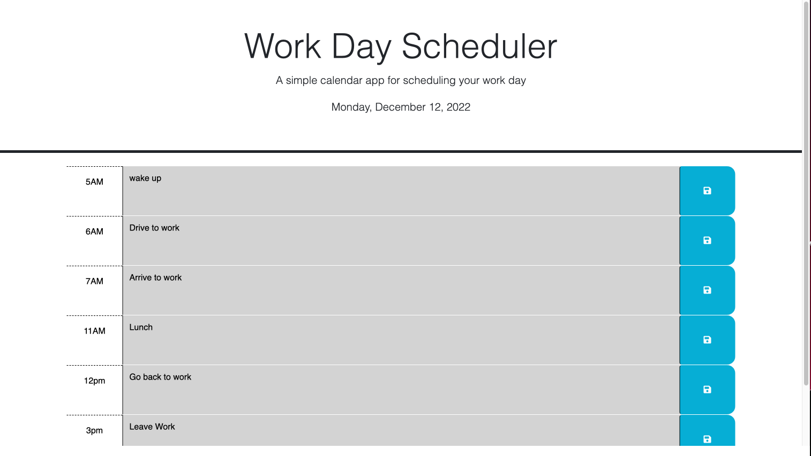

# Third-Party-ApIs

Description
Need to create a schedule to stay organized and to manage your time.

User Story
I want to add event in my planner, so i am able to manage my time correctly

Acceptance Criteria

I want to open my planner
Have the current date in the top
when I click on a block
I  want to add an event init
WHEN I click the save button for that time block
the text for that event is saved in local storage
When i refresh the page it saves

